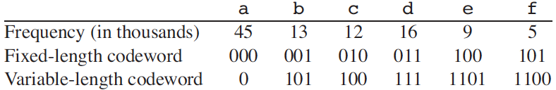
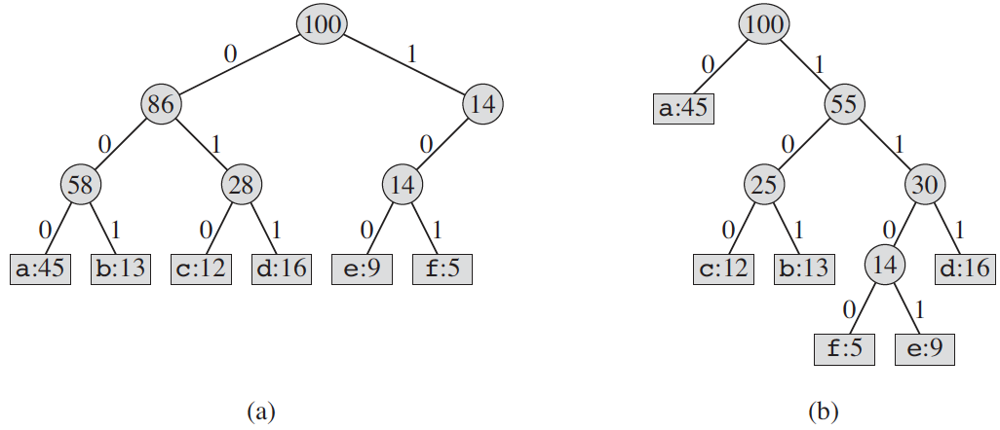

.. _ch16-3:

Huffman codes
=============

Huffman codes compress data very effectively: savings of 20% to 90% are
typical, depending on the characteristics of the data being compressed. We
consider the data to be a sequence of characters. Huffman’s greedy algorithm
uses a table giving how often each character occurs (i.e., its frequency) to
build up an optimal way of representing each character as a binary string.

.. _fig16-3:

    A character-coding problem. A data file of 100,000 characters contains only
    the characters :math:`\mathtt{a{-}f}`, with the frequencies indicated. If
    we assign each character a 3-bit codeword, we can encode the file in
    300,000 bits. Using the variable-length code shown, we can encode the file
    in only 224,000 bits.

Suppose we have a 100,000-character data file that we wish to store compactly.
We observe that the characters in the file occur with the frequencies given by
:ref:`Figure 16.3 <fig16-3>`. That is, only 6 different characters appear, and
the character :math:`\mathtt{a}` occurs 45,000 times.

We have many options for how to represent such a file of information. Here, we
consider the problem of designing a **binary character code** (or **code** for
short) in which each character is represented by a unique binary string, which
we call a **codeword**. If we use a fixed-length code, we need 3 bits to
represent 6 characters: :math:`\mathtt{a=000}`, :math:`\mathtt{b=001}`, ...,
:math:`\mathtt{f=101}`. This method requires 300,000 bits to code the entire
file. Can we do better?

A **variable-length code** can do considerably better than a fixed-length code,
by giving frequent characters short codewords and infrequent characters long
codewords. :ref:`Figure 16.3 <fig16-3>` shows such a code; here the 1-bit
string :math:`\mathtt{0}` represents :math:`\mathtt{a}`, and the 4-bit string
:math:`\mathtt{1100}` represents :math:`\mathtt{f}`. This code requires

.. math::

    (45 \cdot 1 + 13 \cdot 3 + 12 \cdot 3 + 16 \cdot 3 + 9 \cdot 4 + 5 \cdot 4)
    \cdot 1,000 = 224,000 \ \text{bits}

to represent the file, a savings of approximately 25%. In fact, this is an
optimal character code for this file, as we shall see.

.. _ch16-3-1:

Prefix codes
------------

We consider here only codes in which no codeword is also a prefix of some other
codeword. Such codes are called **prefix codes**. [#f3]_ Although we won’t
prove it here, a prefix code can always achieve the optimal data compression
among any character code, and so we suffer no loss of generality by restricting
our attention to prefix codes.

Encoding is always simple for any binary character code; we just concatenate
the codewords representing each character of the file. For example, with the
variable-length prefix code of :ref:`Figure 16.3 <fig16-3>`, we code the
3-character file :math:`\mathtt{abc}` as
:math:`\mathtt{0{\cdot}101{\cdot}100=0101100}`, where “:math:`\cdot`” denotes
concatenation.

Prefix codes are desirable because they simplify decoding. Since no codeword is
a prefix of any other, the codeword that begins an encoded file is unambiguous.
We can simply identify the initial codeword, translate it back to the original
character, and repeat the decoding process on the remainder of the encoded
file. In our example, the string :math:`\mathtt{001011101}` parses uniquely as
:math:`\mathtt{0{\cdot}0{\cdot}101{\cdot}1101}`, which decodes to
:math:`\mathtt{aabe}`.

.. _fig16-4:

    Trees corresponding to the coding schemes in :ref:`Figure 16.3 <fig16-3>`.
    Each leaf is labeled with a character and its frequency of occurrence. Each
    internal node is labeled with the sum of the frequencies of the leaves in
    its subtree. **(a)** The tree corresponding to the fixed-length code
    :math:`\mathtt{a=000}`, ..., :math:`\mathtt{f=101}`. **(b)** The tree
    corresponding to the optimal prefix code :math:`\mathtt{a=0}`,
    :math:`\mathtt{b=101}`, ..., :math:`\mathtt{f=1100}`.

The decoding process needs a convenient representation for the prefix code so
that we can easily pick off the initial codeword. A binary tree whose leaves
are the given characters provides one such representation. We interpret the
binary codeword for a character as the simple path from the root to that
character, where 0 means “go to the left child” and 1 means “go to the right
child.” :ref:`Figure 16.4 <fig16-4>` shows the trees for the two codes of our
example. Note that these are not binary search trees, since the leaves need not
appear in sorted order and internal nodes do not contain character keys.

An optimal code for a file is always represented by a *full* binary tree, in
which every nonleaf node has two children (see
:ref:`Exercise 16.3-2 <ex16-3-2>`). The fixed-length code in our example is not
optimal since its tree, shown in :ref:`Figure 16.4(a) <fig16-4>`, is not a full
binary tree: it contains codewords beginning :math:`\mathtt{10...}`, but none
beginning :math:`\mathtt{11...}`. Since we can now restrict our attention to
full binary trees, we can say that if :math:`C` is the alphabet from which the
characters are drawn and all character frequencies are positive, then the tree
for an optimal prefix code has exactly :math:`|C|` leaves, one for each letter
of the alphabet, and exactly :math:`|C|-1` internal nodes (see
:ref:`Exercise B.5-3 <ex37-5-3>`).

.. xxxxxxxxxxxxxxxxxxxxxxxxxxxxxxxxxxxxxExercise B.5-3

Given a tree :math:`T` corresponding to a prefix code, we can easily compute
the number of bits required to encode a file. For each character :math:`c` in
the alphabet :math:`C`, let the attribute :math:`c.\mathit{freq}` denote the
frequency of :math:`c` in the file and let :math:`d_T(c)` denote the depth of
:math:`c`’s leaf in the tree. Note that :math:`d_T(c)` is also the length of
the codeword for character :math:`c`. The number of bits required to encode a
file is thus

.. math::
    :nowrap:

    \begin{equation}
      B(T)=\sum_{c \in C}c.\mathit{freq}\cdot d_T(c),
    \end{equation}

which we define as the cost of the tree :math:`T`.

Exercises
^^^^^^^^^

.. _ex16-3-2:

**16.3-2** Prove that a binary tree that is not full cannot correspond to an
optimal prefix code.

*Answer:* TODO

.. _ex16-3-3:

**16.3-3** TODO

*Answer:* TODO

.. _ex16-3-4:

**16.3-4** Prove that we can also express the total cost of a tree for a code
as the sum, over all internal nodes, of the combined frequencies of the two
children of the node.

*Answer:* TODO

.. rubric:: Footnotes

.. [#f3] Perhaps “prefix-free codes” would be a better name, but the term
         “prefix codes” is standard in the literature.
