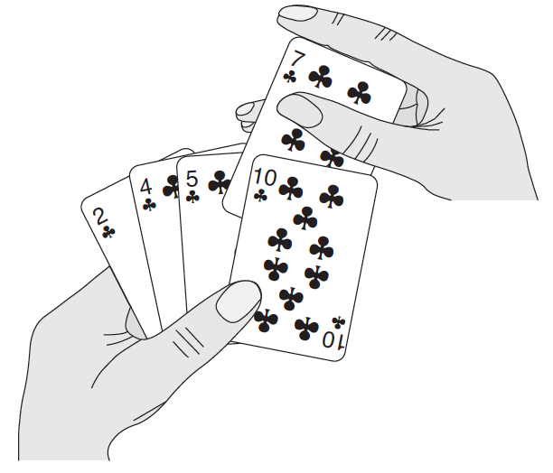
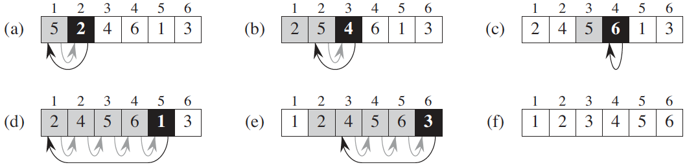

.. _ch2-1:

Insertion sort
==============

.. compound::

    Our first algorithm, insertion sort, solves the :strongemph:`sorting problem`
    introduced in :ref:`Chapter 1 <ch1>`:

    Input:
        A sequence of :math:`n` numbers
        :math:`\langle a_1,a_2,\dots,a_n\rangle`.

    Output:
        A permutation (reordering)
        :math:`\langle a'_1,a'_2,\dots,a'_n\rangle` of the input sequence such
        that :math:`a'_1\le a'_2\le\cdots\le a'_n`.

    The numbers that we wish to sort are also known as the :strongemph:`keys`. Although
    conceptually we are sorting a sequence, the input comes to us in the form
    of an array with :math:`n` elements.

.. _fig2-1:

    Sorting a hand of cards using insertion sort.

In this book, we shall typically describe algorithms as programs written in a
:strongemph:`pseudocode` that is similar in many respects to C, C++, Java, Python, or
Pascal. If you have been introduced to any of these languages, you should have
little trouble reading our algorithms. What separates pseudocode from “real”
code is that in pseudocode, we employ whatever expressive method is most clear
and concise to specify a given algorithm. Sometimes, the clearest method is
English, so do not be surprised if you come across an English phrase or
sentence embedded within a section of “real” code. Another difference between
pseudocode and real code is that pseudocode is not typically concerned with
issues of software engineering. Issues of data abstraction, modularity, and
error handling are often ignored in order to convey the essence of the
algorithm more concisely.

We start with :strongemph:`insertion sort`, which is an efficient algorithm for sorting a
small number of elements. Insertion sort works the way many people sort a hand
of playing cards. We start with an empty left hand and the cards face down on
the table. We then remove one card at a time from the table and insert it into
the correct position in the left hand. To find the correct position for a card,
we compare it with each of the cards already in the hand, from right to left,
as illustrated in :numref:`fig2-1`. At all times, the cards held in the left
hand are sorted, and these cards were originally the top cards of the pile on
the table.

We present our pseudocode for insertion sort as a procedure called
:math:`\textsc{Insertion-Sort}`, which takes as a parameter an array
:math:`A[1\ .\ .\ n]` containing a sequence of length :math:`n` that is to be
sorted. (In the code, the number :math:`n` of elements in :math:`A` is denoted
by :math:`A.\mathit{length}`.) The algorithm sorts the input numbers
:strongemph:`in place`: it rearranges the numbers within the array :math:`A`, with at
most a constant number of them stored outside the array at any time. The input
array :math:`A` contains the sorted output sequence when the
:math:`\textsc{Insertion-Sort}` procedure is finished.

.. literalinclude:: /../src/algointro/algo/sort.py
    :caption: :py:func:`algointro.algo.sort.insertion_sort`
    :linenos:
    :pyobject: insertion_sort

.. raw:: latex
    \begin{codebox}

.. rst-class:: codebox

    \Procname{:math:`\proc{Insertion-Sort}(A)`}
    |li| :kw:`for` :math:`j \gets 2` :kw:`to` :math:`\attrib{A}{length}`
    |li| :math:`\id{key} \gets A[j]`
    |li| \Comment Insert :math:`A[j]` into the sorted sequence
    $A[1 \twodots j-1]$.
    |li| $i \gets j-1$
    |li| \While $i > 0$ and $A[i] > \id{key}$
    |li| $A[i+1] \gets A[i]$
    |li| $i \gets i-1$
    |li| $A[i+1] \gets \id{key}$

.. raw:: latex
    \end{codebox}

.. _ch2-1-1:

Loop invariants and the correctness of insertion sort
-----------------------------------------------------

.. _fig2-2:

    The operation of :math:`\textsc{Insertion-Sort}` on the array
    :math:`A=\langle 5,2,4,6,1,3 \rangle`. Array indices appear above the
    rectangles, and values stored in the array positions appear within the
    rectangles. :strongemph:`(a)–(e)` The iterations of the :math:`\texttt{for}` loop of
    lines 1–8. In each iteration, the black rectangle holds the key taken from
    :math:`A[j]`, which is compared with the values in shaded rectangles to its
    left in the test of line 5. Shaded arrows show array values moved one
    position to the right in line 6, and black arrows indicate where the key
    moves to in line 8. :strongemph:`(f)` The final sorted array.

    .. literalinclude:: /../tests/algo/test_sort.py
        :caption: test_sort.InsertionSortTestCase.test_insertion_sort
        :linenos:
        :pyobject: InsertionSortTestCase.test_insertion_sort

:numref:`fig2-2` shows how this algorithm works for
:math:`A=\langle5,2,4,6,1,3\rangle`. The index :math:`j` indicates the “current
card” being inserted into the hand. At the beginning of each iteration of the
:math:`\texttt{for}` loop, which is indexed by :math:`j`, the subarray
consisting of elements :math:`A[1\ .\ .\ j-1]` constitutes the currently sorted
hand, and the remaining subarray :math:`A[j+1\ .\ .\ n]` corresponds to the
pile of cards still on the table. In fact, elements :math:`A[1\ .\ .\ j-1]` are
the elements *originally* in positions :math:`1` through :math:`j-1`, but now
in sorted order. We state these properties of :math:`A[1\ .\ .\ j-1]` formally
as a :strongemph:`loop invariant`:

    At the start of each iteration of the :math:`\texttt{for}` loop of lines
    1–8, the subarray :math:`A[1\ .\ .\ j-1]` consists of the elements
    originally in :math:`A[1\ .\ .\ j-1]`, but in sorted order.

.. compound::

    We use loop invariants to help us understand why an algorithm is correct.
    We must show three things about a loop invariant:

    Initialization:
        It is true prior to the first iteration of the loop.

    Maintenance:
        If it is true before an iteration of the loop, it remains true before
        the next iteration.

    Termination:
        When the loop terminates, the invariant gives us a useful property that
        helps show that the algorithm is correct.

    When the first two properties hold, the loop invariant is true prior to
    every iteration of the loop. (Of course, we are free to use established
    facts other than the loop invariant itself to prove that the loop invariant
    remains true before each iteration.) Note the similarity to mathematical
    induction, where to prove that a property holds, you prove a base case and
    an inductive step. Here, showing that the invariant holds before the first
    iteration corresponds to the base case, and showing that the invariant
    holds from iteration to iteration corresponds to the inductive step.

The third property is perhaps the most important one, since we are using the
loop invariant to show correctness. Typically, we use the loop invariant along
with the condition that caused the loop to terminate. The termination property
differs from how we usually use mathematical induction, in which we apply the
inductive step infinitely; here, we stop the “induction” when the loop
terminates.

.. compound::

    Let us see how these properties hold for insertion sort.

    Initialization:
        We start by showing that the loop invariant holds before the first loop
        iteration, when :math:`j=2`. [1]_ The subarray :math:`A[1\ .\ .\ j-1]`,
        therefore, consists of just the single element :math:`A[1]`, which is in
        fact the original element in :math:`A[1]`. Moreover, this subarray is
        sorted (trivially, of course), which shows that the loop invariant holds
        prior to the first iteration of the loop.

    Maintenance:
        Next, we tackle the second property: showing that each iteration maintains
        the loop invariant. Informally, the body of the :math:`\texttt{for}` loop
        works by moving :math:`A[j-1]`, :math:`A[j-2]`, :math:`A[j-3]`, and so on
        by one position to the right until it finds the proper position for 
        :math:`A[j]` (lines 4–7), at which point it inserts the value of
        :math:`A[j]` (line 8). The subarray :math:`A[1\ .\ .\ j]` then consists of
        the elements originally in :math:`A[1\ .\ .\ j]`, but in sorted order.
        Incrementing :math:`j` for the next iteration of the :math:`\texttt{for}`
        loop then preserves the loop invariant. A more formal treatment of the
        second property would require us to state and show a loop invariant for the
        while loop of lines 5–7. At this point, however, we prefer not to get
        bogged down in such formalism, and so we rely on our informal analysis to
        show that the second property holds for the outer loop.

    Termination:
        Finally, we examine what happens when the loop terminates. The condition
        causing the :math:`\texttt{for}` loop to terminate is that
        :math:`j > A.\mathit{length} = n`. Because each loop iteration increases
        :math:`j` by :math:`1`, we must have :math:`j=n+1` at that time.
        Substituting :math:`n+1` for :math:`j` in the wording of loop invariant, we
        have that the subarray :math:`A[1\ .\ .\ n]` consists of the elements
        originally in :math:`A[1\ .\ .\ n]`, but in sorted order. Observing that
        the subarray :math:`A[1\ .\ .\ n]` is the entire array, we conclude that
        the entire array is sorted. Hence, the algorithm is correct.

We shall use this method of loop invariants to show correctness later in this
chapter and in other chapters as well.

.. _ch2-1-2:

Pseudocode conventions
----------------------

We use the following conventions in our pseudocode.

* Indentation indicates block structure. For example, the body of the
  :math:`\texttt{for}` loop that begins on line 1 consists of lines 2–8, and
  the body of the :math:`\texttt{while}` loop that begins on line 5 contains
  lines 6–7 but not line 8. Our indentation style applies to
  :math:`\texttt{if-else}` statements [2]_ as well. Using indentation instead
  of conventional indicators of block structure, such as :math:`\texttt{begin}`
  and :math:`\texttt{end}` statements, greatly reduces clutter while
  preserving, or even enhancing, clarity. [3]_

* The looping constructs :math:`\texttt{while}`, :math:`\texttt{for}`, and
  :math:`\texttt{repeat-until}` and the :math:`\texttt{if-else}` conditional
  construct have interpretations similar to those in C, C++, Java, Python, and
  Pascal. [4]_ In this book, the loop counter retains its value after exiting
  the loop, unlike some situations that arise in C++, Java, and Pascal. Thus,
  immediately after a :math:`\texttt{for}` loop, the loop counter’s value is
  the value that first exceeded the :math:`\texttt{for}` loop bound. We used
  this property in our correctness argument for insertion sort. The
  :math:`\texttt{for}` loop header in line 1 is
  :math:`\texttt{for }j=2\texttt{ to }A.\mathit{length}`, and so when this loop
  terminates, :math:`j=A.\mathit{length}+1` (or, equivalently, :math:`j=n+1`,
  since :math:`n=A.\mathit{length}`). We use the keyword :math:`\texttt{to}`
  when a :math:`\texttt{for}` loop increments its loop counter in each
  iteration, and we use the keyword :math:`\texttt{downto}` when a
  :math:`\texttt{for}` loop decrements its loop counter. When the loop counter
  changes by an amount greater than :math:`1`, the amount of change follows the
  optional keyword :math:`\texttt{by}`.

* The symbol “:math:`\texttt{//}`” indicates that the remainder of the line is
  a comment.

* A multiple assignment of the form :math:`i=j=e` assigns to both variables
  :math:`i` and :math:`j` the value of expression :math:`e`; it should be
  treated as equivalent to the assignment :math:`j=e` followed by the
  assignment :math:`i=j`.

* Variables (such as :math:`i`, :math:`j`, and :math:`\mathit{key}`) are local
  to the given procedure. We shall not use global variables without explicit
  indication.

* We access array elements by specifying the array name followed by the index
  in square brackets. For example, :math:`A[i]` indicates the :math:`i`\ th
  element of the array :math:`A`. The notation “:math:`.\ .`” is used to
  indicate a range of values within an array. Thus, :math:`A[1\ .\ .\ j]`
  indicates the subarray of :math:`A` consisting of the :math:`j` elements
  :math:`A[1]`, :math:`A[2]`, ..., :math:`A[j]`.

* We typically organize compound data into :strongemph:`objects`, which are composed of
  :strongemph:`attributes`. We access a particular attribute using the syntax found in 
  many object-oriented programming languages: the object name, followed by a
  dot, followed by the attribute name. For example, we treat an array as an
  object with the attribute :math:`\mathit{length}` indicating how many
  elements it contains. To specify the number of elements in an array
  :math:`A`, we write :math:`A.\mathit{length}`.

  We treat a variable representing an array or object as a pointer to the data
  representing the array or object. For all attributes :math:`f` of an object
  :math:`x`, setting :math:`y=x` causes :math:`y.f` to equal :math:`x.f`.
  Moreover, if we now set :math:`x.f=3`, then afterward not only does
  :math:`x.f` equal :math:`3`, but :math:`y.f` equals :math:`3` as well. In
  other words, :math:`x` and :math:`y` point to the same object after the
  assignment :math:`y=x`.

  Our attribute notation can “cascade.” For example, suppose that the attribute
  :math:`f` is itself a pointer to some type of object that has an attribute
  :math:`g`. Then the notation :math:`x.f.g` is implicitly parenthesized as
  :math:`(x.f).g`. In other words, if we had assigned :math:`y=x.f`, then
  :math:`x.f.g` is the same as :math:`y.g`.

  Sometimes, a pointer will refer to no object at all. In this case, we give it
  the special value :cnst:`nil`.

* We pass parameters to a procedure :strongemph:`by value`: the called
  procedure receives its own copy of the parameters, and if it assigns a value
  to a parameter, the change is *not* seen by the calling procedure. When
  objects are passed, the pointer to the data representing the object is
  copied, but the object’s attributes are not. For example, if :math:`x` is a
  parameter of a called procedure, the assignment :math:`x=y` within the called
  procedure is not visible to the calling procedure. The assignment
  :math:`x.f=3`, however, is visible. Similarly, arrays are passed by pointer,
  so that a pointer to the array is passed, rather than the entire array, and
  changes to individual array elements are visible to the calling procedure.

* A :kw:`return` statement immediately transfers control back to the
  point of call in the calling procedure. Most :math:`\texttt{return}`
  statements also take a value to pass back to the caller. Our pseudocode
  differs from many programming languages in that we allow multiple values to
  be returned in a single :proc:`return` statement.

* The boolean operators “and” and “or” are :strongemph:`short circuiting`. That
  is, when we evaluate the expression “:math:`x` and :math:`y`” we first
  evaluate :math:`x`. If :math:`x` evaluates to :cnst:`false`, then the entire
  expression cannot evaluate to :cnst:`true`, and so we do not evaluate :math:`y`. If,
  on the other hand, :math:`x` evaluates to :math:`\textsc{true}`, we must
  evaluate :math:`y` to determine the value of the entire expression.
  Similarly, in the expression “:math:`x\texttt{ or }y`” we evaluate the
  expression :math:`y` only if :math:`x` evaluates to :math:`\textsc{false}`.
  Short-circuiting operators allow us to write boolean expressions such as
  “:math:`x\neq \textsc{nil}\texttt{ and } x.f=y`” without worrying about what
  happens when we try to evaluate :math:`x.f` when :math:`x` is
  :math:`\textsc{nil}`.

* The keyword :math:`\texttt{error}` indicates that an error occurred because
  conditions were wrong for the procedure to have been called. The calling
  procedure is responsible for handling the error, and so we do not specify
  what action to take.

.. _ex2-1:

Exercises
^^^^^^^^^

.. _ex2-1-1:

**2.1-1** Using :ref:`Figure 2.2 <fig2-2>` as a model, illustrate the operation
of :math:`\textsc{Insertion-Sort}` on the array
:math:`A = \langle 31, 41, 59, 26, 41, 58 \rangle`.

*Answer:*

.. literalinclude:: /../tests/algo/test_sort.py
    :linenos:
    :pyobject: InsertionSortTestCase.test_insertion_sort_nondecrease

.. _ex2-1-2:

**2.1-2** Rewrite the :math:`\textsc{Insertion-Sort}` procedure to
sort into nonincreasing instead of nondecreasing order.

*Answer:*

.. literalinclude:: /../tests/algo/test_sort.py
    :linenos:
    :pyobject: InsertionSortTestCase.test_insertion_sort_nonincrease

.. _ex2-1-3:

**2.1-3** Consider the :strongemph:`searching problem`:

**Input:**
    A sequence of :math:`n` numbers
    :math:`A = \langle a_1,a_2,\dots,a_n \rangle` and a value :math:`v`.

**Output:**
    An index :math:`i` such that :math:`v=A[i]` or the special value
    :math:`\textsc{nil}` if :math:`v` does not appear in :math:`A`.

Write pseudocode for :strongemph:`linear search`, which scans through the sequence,
looking for :math:`v`. Using a loop invariant, prove that your algorithm is
correct. Make sure that your loop invariant fulfills the three necessary
properties.

*Answer:*

:py:func:`algointro.algo.search.linear_search`:

.. literalinclude:: /../src/algointro/algo/search.py
    :linenos:
    :pyobject: linear_search

loop invariant:
    The subarray :math:`A[1\ .\ .\ i-1]` doesn't contain the value :math:`v`.

.. _ex2-1-4:

**2.1-4** Consider the problem of adding two :math:`n`-bit binary integers,
stored in two :math:`n`-element arrays :math:`A` and :math:`B`. The sum of the
two integers should be stored in binary form in an :math:`(n+1)`-element array
:math:`C`. State the problem formally and write pseudocode for adding the two
integers.

*Answer:*

Input:
    Two :math:`n`-bit binary integers, stored in two :math:`n`-element arrays
    :math:`A` and :math:`B`.

Output:
    The sum of :math:`A` and :math:`B` stored in binary form in an
    :math:`(n+1)`-element array :math:`C`.

:py:func:`algointro.algo.misc.add_binary`:

.. literalinclude:: /../src/algointro/algo/misc.py
    :linenos:
    :pyobject: add_binary

.. rubric:: Footnotes

.. [1] When the loop is a :math:`\texttt{for}` loop, the moment at which we
    check the loop invariant just prior to the first iteration is immediately
    after the initial assignment to the loop-counter variable and just before
    the first test in the loop header. In the case of
    :math:`\textsc{Insertion-Sort}`, this time is after assigning
    :math:`2` to the variable :math:`j` but before the first test of whether
    :math:`j \le A.\mathit{length}`.

.. [2] In an :math:`\texttt{if-else}` statement, we indent
    :math:`\texttt{else}` at the same level as its matching
    :math:`\texttt{if}`. Although we omit the keyword :math:`\texttt{then}`, we
    occasionally refer to the portion executed when the test following
    :math:`\texttt{if}` is true as a :strongemph:`then clause`. For multiway tests, we
    use :math:`\texttt{elseif}` for tests after the first one.

.. [3] Each pseudocode procedure in this book appears on one page so that you
    will not have to discern levels of indentation in code that is split across
    pages.

.. [4] Most block-structured languages have equivalent constructs, though the
    exact syntax may differ. Python lacks :math:`\texttt{repeat-until}` loops,
    and its :math:`\texttt{for}` loops operate a little differently from the
    :math:`\texttt{for}` loops in this book.
