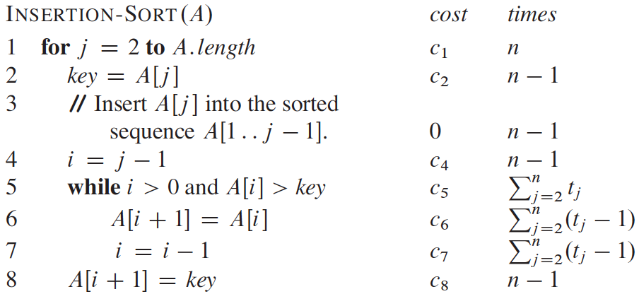

.. _ch2-2:

Analyzing algorithms
====================

Analyzing an algorithm has come to mean predicting the resources that the
algorithm requires. Occasionally, resources such as memory, communication
bandwidth, or computer hardware are of primary concern, but most often it is
computational time that we want to measure. Generally, by analyzing several
candidate algorithms for a problem, we can identify a most efficient one. Such
analysis may indicate more than one viable candidate, but we can often discard
several inferior algorithms in the process.

Before we can analyze an algorithm, we must have a model of the implementation
technology that we will use, including a model for the resources of that
technology and their costs. For most of this book, we shall assume a generic
one-processor, :strongemph:`random-access machine (RAM)` model of computation
as our implementation technology and understand that our algorithms will be
implemented as computer programs. In the RAM model, instructions are executed
one after another, with no concurrent operations.

Strictly speaking, we should precisely define the instructions of the RAM model
and their costs. To do so, however, would be tedious and would yield little
insight into algorithm design and analysis. Yet we must be careful not to abuse
the RAM model. For example, what if a RAM had an instruction that sorts? Then
we could sort in just one instruction. Such a RAM would be unrealistic, since
real computers do not have such instructions. Our guide, therefore, is how real
computers are designed. The RAM model contains instructions commonly found in
real computers: arithmetic (such as add, subtract, multiply, divide, remainder,
floor, ceiling), data movement (load, store, copy), and control (conditional
and unconditional branch, subroutine call and return). Each such instruction
takes a constant amount of time.

The data types in the RAM model are integer and floating point (for storing
real numbers). Although we typically do not concern ourselves with precision in
this book, in some applications precision is crucial. We also assume a limit on
the size of each word of data. For example, when working with inputs of size
:math:`n`, we typically assume that integers are represented by :math:`c\lg n`
bits for some constant :math:`c\ge 1`. We require :math:`c\ge 1` so that each
word can hold the value of :math:`n`, enabling us to index the individual input
elements, and we restrict :math:`c` to be a constant so that the word size does
not grow arbitrarily. (If the word size could grow arbitrarily, we could store
huge amounts of data in one word and operate on it all in constant time—clearly
an unrealistic scenario.)

Real computers contain instructions not listed above, and such instructions
represent a gray area in the RAM model. For example, is exponentiation a
constant time instruction? In the general case, no; it takes several
instructions to compute :math:`x^y` when :math:`x` and :math:`y` are real
numbers. In restricted situations, however, exponentiation is a constant-time
operation. Many computers have a “shift left” instruction, which in constant
time shifts the bits of an integer by :math:`k` positions to the left. In most
computers, shifting the bits of an integer by one position to the left is
equivalent to multiplication by :math:`2`, so that shifting the bits by
:math:`k` positions to the left is equivalent to multiplication by
:math:`2^k`. Therefore, such computers can compute :math:`2^k` in one
constant-time instruction by shifting the integer :math:`1` by :math:`k`
positions to the left, as long as :math:`k` is no more than the number of bits
in a computer word. We will endeavor to avoid such gray areas in the RAM model,
but we will treat computation of :math:`2^k` as a constant-time operation when
:math:`k` is a small enough positive integer.

In the RAM model, we do not attempt to model the memory hierarchy that is
common in contemporary computers. That is, we do not model caches or virtual
memory. Several computational models attempt to account for memory-hierarchy
effects, which are sometimes significant in real programs on real machines. A
handful of problems in this book examine memory-hierarchy effects, but for the
most part, the analyses in this book will not consider them. Models that
include the memory hierarchy are quite a bit more complex than the RAM model,
and so they can be difficult to work with. Moreover, RAM-model analyses are
usually excellent predictors of performance on actual machines.

Analyzing even a simple algorithm in the RAM model can be a challenge. The
mathematical tools required may include combinatorics, probability theory,
algebraic dexterity, and the ability to identify the most significant terms in
a formula. Because the behavior of an algorithm may be different for each
possible input, we need a means for summarizing that behavior in simple, easily
understood formulas.

Even though we typically select only one machine model to analyze a given
algorithm, we still face many choices in deciding how to express our analysis.
We would like a way that is simple to write and manipulate, shows the important
characteristics of an algorithm’s resource requirements, and suppresses tedious
details.

.. _ch2-2-1:

Analysis of insertion sort
--------------------------

The time taken by the :proc:`Insertion-Sort` procedure depends on the input:
sorting a thousand numbers takes longer than sorting three numbers. Moreover,
:proc:`Insertion-Sort` can take different amounts of time to sort two input
sequences of the same size depending on how nearly sorted they already are. In
general, the time taken by an algorithm grows with the size of the input, so it
is traditional to describe the running time of a program as a function of the
size of its input. To do so, we need to define the terms “running time” and
“size of input” more carefully.

The best notion for :strongemph:`input size` depends on the problem being studied. For
many problems, such as sorting or computing discrete Fourier transforms, the
most natural measure is the *number of items in the input*—for example, the
array size :math:`n` for sorting. For many other problems, such as multiplying
two integers, the best measure of input size is the *total number of bits*
needed to represent the input in ordinary binary notation. Sometimes, it is
more appropriate to describe the size of the input with two numbers rather than
one. For instance, if the input to an algorithm is a graph, the input size can
be described by the numbers of vertices and edges in the graph. We shall
indicate which input size measure is being used with each problem we study.

The :strongemph:`running time` of an algorithm on a particular input is the number of
primitive operations or “steps” executed. It is convenient to define the notion
of step so that it is as machine-independent as possible. For the moment, let
us adopt the following view. A constant amount of time is required to execute
each line of our pseudocode. One line may take a different amount of time than
another line, but we shall assume that each execution of the :math:`i`\ th line
takes time :math:`c_i`, where :math:`c_i` is a constant. This viewpoint is in
keeping with the RAM model, and it also reflects how the pseudocode would be
implemented on most actual computers. [5]_

In the following discussion, our expression for the running time of
:proc:`Insertion-Sort` will evolve from a messy formula that uses all
the statement costs :math:`c_i` to a much simpler notation that is more concise
and more easily manipulated. This simpler notation will also make it easy to
determine whether one algorithm is more efficient than another.

We start by presenting the :proc:`Insertion-Sort` procedure with the
time “cost” of each statement and the number of times each statement is
executed. For each :math:`j=2,3,\dots,n`, where :math:`n=A.\mathit{length}`, we
let :math:`t_j` denote the number of times the :kw:`while` loop test
in line 5 is executed for that value of :math:`j`. When a :kw:`for`
or :kw:`while` loop exits in the usual way (i.e., due to the test in
the loop header), the test is executed one time more than the loop body. We
assume that comments are not executable statements, and so they take no time.

The running time of the algorithm is the sum of running times for each
statement executed; a statement that takes :math:`c_i` steps to execute and
executes :math:`n` times will contribute :math:`c_i n` to the total running
time. [6]_ To compute :math:`T(n)`, the running time of
:math:`\textsc{Insertion-Sort}` on an input of :math:`n` values, we sum the
products of the cost and times columns, obtaining

.. math::
    T(n) = c_1n+c_2(n-1)+c_4(n-1)+c_5\sum_{j=2}^n t_j + c_6\sum_{j=2}^n(t_j-1)
    +c_7\sum_{j=2}^n(t_j-1)+c_8(n-1).

Even for inputs of a given size, an algorithm’s running time may depend on
which input of that size is given. For example, in
:math:`\textsc{Insertion-Sort}`, the best case occurs if the array is already
sorted. For each :math:`j=2,3,\dots,n`, we then find that :math:`A[i]\le key`
in line 5 when :math:`i` has its initial value of :math:`j-1`. Thus
:math:`t_j=1` for :math:`j=2,3,\dots,n`, and the best-case running time is

.. math::

    T(n) &= c_1n + c_2(n-1) + c_4(n-1) + c_5(n-1) + c_8(n-1) \\
         &= (c_1+c_2+c_4+c_5+c_8)n - (c_2+c_4+c_5+c_8)

We can express this running time as an :proc:`Insertion-Sort` for *constants*
:math:`a` and :math:`b` that depend on the statement costs :math:`c_i`; it is
thus a :strongemph:`linear function` of :math:`n`.

.. compound::

    If the array is in reverse sorted order—that is, in decreasing order—the
    worst case results. We must compare each element :math:`A[j]` with each
    element in the entire sorted subarray :math:`A[1\ .\ .\ j-1]`, and so
    :math:`t_j=j` for :math:`j=2,3,\dots,n`. Noting that

    .. math::

        \sum_{j=2}^n j = \frac{n(n+1)}{2} - 1

    and

    .. math::
    
        \sum_{j=2}^n (j-1) = \frac{n(n-1)}{2}

    (see :ref:`Appendix A <ch36>` for a review of how to solve these
    summations), we find that in the worst case, the running time of
    :math:`\textsc{Insertion-Sort}` is

    .. math::

        T(n) &= c_1 n+c_2(n-1)+c_4(n-1)+c_5 \left(\frac{n(n+1)}{2}-1 \right) +
                c_6\left(\frac{n(n-1)}{2}\right)+c_7\left(\frac{n(n-1)}{2}\right) +
                c_8(n-1) \\
             &= \left(\frac{c_5}{2}+\frac{c_6}{2}+\frac{c_7}{2}\right)n^2 +
                \left(c_1+c_2+c_4+\frac{c_5}{2}-
                \frac{c_6}{2}-\frac{c_7}{2}+c_8\right)n -
                (c_2+c_4+c_5+c_8).

    We can express this worst-case running time as :math:`an^2+bn+c` for constants
    :math:`a`, :math:`b`, and :math:`c` that again depend on the statement costs
    :math:`c_i`; it is thus a **quadratic function** of :math:`n`.

Typically, as in insertion sort, the running time of an algorithm is fixed for
a given input, although in later chapters we shall see some interesting
“randomized” algorithms whose behavior can vary even for a fixed input.

.. _ch2-2-2:

Worst-case and average-case analysis
------------------------------------

In our analysis of insertion sort, we looked at both the best case, in which
the input array was already sorted, and the worst case, in which the input
array was reverse sorted. For the remainder of this book, though, we shall
usually concentrate on finding only the **worst-case running time**, that is,
the longest running time for any input of size :math:`n`. We give three reasons
for this orientation.

* The worst-case running time of an algorithm gives us an upper bound on the
  running time for any input. Knowing it provides a guarantee that the
  algorithm will never take any longer. We need not make some educated guess
  about the running time and hope that it never gets much worse.

* For some algorithms, the worst case occurs fairly often. For example, in
  searching a database for a particular piece of information, the searching
  algorithm’s worst case will often occur when the information is not present
  in the database. In some applications, searches for absent information may be
  frequent.

* The “average case” is often roughly as bad as the worst case. Suppose that we
  randomly choose n numbers and apply insertion sort. How long does it take to
  determine where in subarray :math:`A[1\ .\ .\ j-1]` to insert element
  :math:`A[j]`? On average, half the elements in :math:`A[1\ .\ .\ j-1]` are
  less than :math:`A[j]`, and half the elements are greater. On average,
  therefore, we check half of the subarray :math:`A[1\ .\ .\ j-1]`, and so
  :math:`t_j` is about :math:`j/2`. The resulting average-case running time
  turns out to be a quadratic function of the input size, just like the
  worst-case running time.

In some particular cases, we shall be interested in the **average-case**
running time of an algorithm; we shall see the technique of
**probabilistic analysis** applied to various algorithms throughout this book.
The scope of average-case analysis is limited, because it may not be apparent
what constitutes an “average” input for a particular problem. Often, we shall
assume that all inputs of a given size are equally likely. In practice, this
assumption may be violated, but we can sometimes use a
**randomized algorithm**, which makes random choices, to allow a probabilistic
analysis and yield an **expected** running time. We explore randomized
algorithms more in :ref:`Chapter 5 <ch5>` and in several other subsequent
chapters.

.. _ch2-2-3:

Order of growth
---------------

We used some simplifying abstractions to ease our analysis of the
:proc:`Insertion-Sort` procedure. First, we ignored the actual cost of
each statement, using the constants :math:`c_i` to represent these costs. Then,
we observed that even these constants give us more detail than we really need:
we expressed the worst-case running time as :math:`an^2+bn+c` for some
constants :math:`a`, :math:`b`, and :math:`c` that depend on the statement
costs :math:`c_i`. We thus ignored not only the actual statement costs, but
also the abstract costs :math:`c_i`.

We shall now make one more simplifying abstraction: it is the
**rate of growth**, or **order of growth**, of the running time that really
interests us. We therefore consider only the leading term of a formula (e.g.,
:math:`an^2`), since the lower-order terms are relatively insignificant for
large values of :math:`n`. We also ignore the leading term’s constant
coefficient, since constant factors are less significant than the rate of
growth in determining computational efficiency for large inputs. For insertion
sort, when we ignore the lower-order terms and the leading term’s constant
coefficient, we are left with the factor of :math:`n^2` from the leading term.
We write that insertion sort has a worst-case running time of
:math:`\Theta(n^2)` (pronounced “theta of :math:`n`-squared”). We shall use
:math:`\Theta`-notation informally in this chapter, and we will define it
precisely in :ref:`Chapter 3 <ch3>`.

We usually consider one algorithm to be more efficient than another if its
worst-case running time has a lower order of growth. Due to constant factors
and lower-order terms, an algorithm whose running time has a higher order of
growth might take less time for small inputs than an algorithm whose running
time has a lower order of growth. But for large enough inputs, a
:math:`\Theta(n^2)` algorithm, for example, will run more quickly in the worst
case than a :math:`\Theta(n^3)` algorithm.

.. _ex2-2:

Exercises
^^^^^^^^^

.. _ex2-2-1:

**2.2-1** Express the function :math:`n^3/1000-100n^2-100n+3` in terms of
:math:`\Theta`-notation.

*Answer:*

.. math::
    \frac{n^3}{1000}-100n^2-100n+3 = \Theta(n^3)

.. _ex2-2-2:

**2.2-2** Consider sorting :math:`n` numbers stored in array :math:`A` by first
finding the smallest element of :math:`A` and exchanging it with the element
:math:`A[1]`. Then find the second smallest element of :math:`A`, and exchange
it with :math:`A[2]`. Continue in this manner for the first :math:`n-1`
elements of :math:`A`. Write pseudocode for this algorithm, which is known as
**selection sort**. What loop invariant does this algorithm maintain? Why does
it need to run for only the first :math:`n-1` elements, rather than for all
:math:`n` elements? Give the best-case and worst-case running times of
selection sort in :math:`\Theta`-notation.

*Answer\*:*

:py:func:`algointro.algo.sort.selection_sort`:

.. literalinclude:: /../src/algointro/algo/sort.py
    :linenos:
    :pyobject: selection_sort

The algorithm maintains the loop invariant that at the start of each iteration
of the outer :kw:`for` loop, the subarray :math:`A[1\ .\ .\ j-1]`
consists of the :math:`j-1` smallest elements in the array
:math:`A[1\ .\ .\ n]`, and this subarray is in sorted order. After the first
:math:`n-1` elements, the subarray :math:`A[1\ .\ .\ n-1]` contains the
smallest :math:`n-1` elements, sorted, and therefore element :math:`A[n]` must
be the largest element. The running time of the algorithm is
:math:`\Theta(n^2)` for all cases.

.. _ex2-2-3:

**2.2-3** Consider linear search again (see :ref:`Exercise 2.1-3 <ex2-1-3>`).
How many elements of the input sequence need to be checked on the average,
assuming that the element being searched for is equally likely to be any
element in the array? How about in the worst case? What are the average-case
and worst-case running times of linear search in :math:`\Theta`-notation?
Justify your answers.

*Answer:*

Average-case:
    :math:`(n+1)/2=\Theta(n)`.

Worst-case:
    :math:`n=\Theta(n)`.

.. _ex2-2-4:

**2.2-4** How can we modify almost any algorithm to have a good best-case
running time?

*Answer\*:*

Modify the algorithm so it tests whether the input satisfies some special-case
condition and, if it does, output a pre-computed answer. The best-case running
time is generally not a good measure of an algorithm.

.. rubric:: Footnotes

.. [5] There are some subtleties here. Computational steps that we specify in
    English are often variants of a procedure that requires more than just a
    constant amount of time. For example, later in this book we might say “sort
    the points by :math:`x`-coordinate,” which, as we shall see, takes more
    than a constant amount of time. Also, note that a statement that calls a
    subroutine takes constant time, though the subroutine, once invoked, may
    take more. That is, we separate the process of **calling** the
    subroutine—passing parameters to it, etc.—from the process of **executing**
    the subroutine.

.. [6] This characteristic does not necessarily hold for a resource such as
    memory. A statement that references :math:`m` words of memory and is
    executed :math:`n` times does not necessarily reference :math:`mn` distinct
    words of memory.
