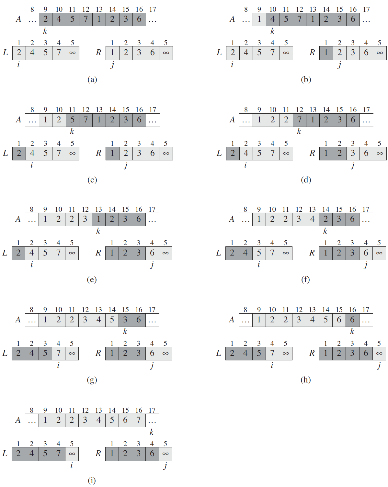
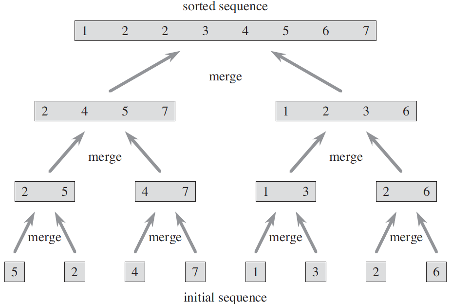
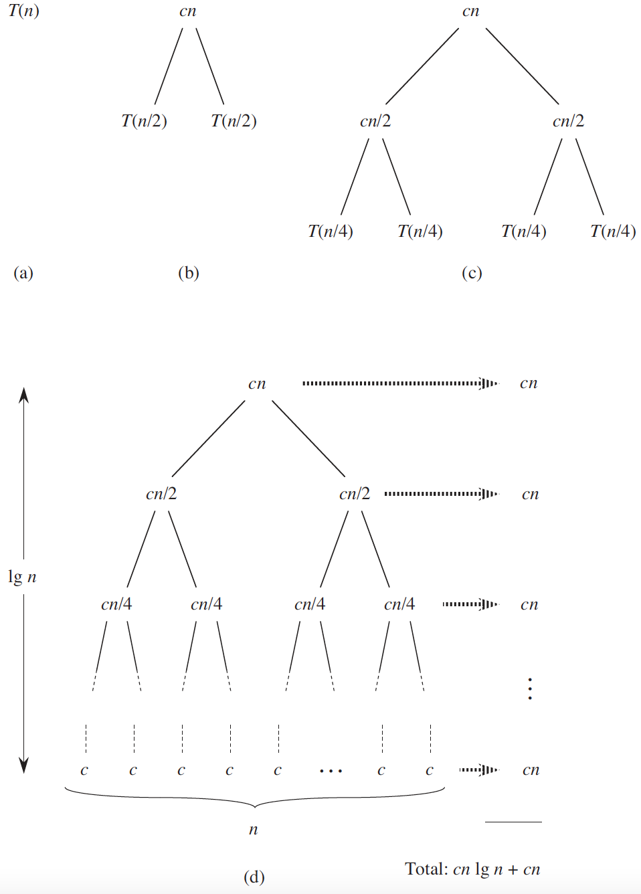

.. _ch2-3:

Designing algorithms
====================

We can choose from a wide range of algorithm design techniques. For insertion
sort, we used an **incremental** approach: having sorted the subarray
:math:`A[1\,.\,.\,j-1]`, we inserted the single element :math:`A[j]` into its
proper place, yielding the sorted subarray :math:`A[1\,.\,.\,j]`.

In this section, we examine an alternative design approach, known as
“divide-and-conquer,” which we shall explore in more detail in
:ref:`Chapter 4 <ch4>`. We’ll use divide-and-conquer to design a sorting
algorithm whose worst-case running time is much less than that of insertion
sort. One advantage of divide-and-conquer algorithms is that their running
times are often easily determined using techniques that we will see in
:ref:`Chapter 4 <ch4>`.

.. _ch2-3-1:

The divide-and-conquer approach
-------------------------------

Many useful algorithms are **recursive** in structure: to solve a given
problem, they call themselves recursively one or more times to deal with
closely related subproblems. These algorithms typically follow a
**divide-and-conquer** approach: they break the problem into several
subproblems that are similar to the original problem but smaller in size, solve
the subproblems recursively, and then combine these solutions to create a
solution to the original problem.

The divide-and-conquer paradigm involves three steps at each level of the
recursion:

Divide
    the problem into a number of subproblems that are smaller instances of the
    same problem.

Conquer
    the subproblems by solving them recursively. If the subproblem sizes are
    small enough, however, just solve the subproblems in a straightforward
    manner.

Combine
    the solutions to the subproblems into the solution for the original
    problem.

The **merge sort** algorithm closely follows the divide-and-conquer paradigm.
Intuitively, it operates as follows.

Divide:
    Divide the :math:`n`-element sequence to be sorted into two subsequences of
    :math:`n/2` elements each.

Conquer:
    Sort the two subsequences recursively using merge sort.

Combine:
    Merge the two sorted subsequences to produce the sorted answer.

The recursion “bottoms out” when the sequence to be sorted has length
:math:`1`, in which case there is no work to be done, since every sequence of
length :math:`1` is already in sorted order.

The key operation of the merge sort algorithm is the merging of two sorted
sequences in the “combine” step. We merge by calling an auxiliary procedure
:math:`\textsc{Merge}(A,p,q,r)`, where :math:`A` is an array and :math:`p`,
:math:`q`, and :math:`r` are indices into the array such that :math:`p\le q<r`.
The procedure assumes that the subarrays :math:`A[p\ .\ .\ q]` and
:math:`A[q+1\ .\ .\ r]` are in sorted order. It **merges** them to form a
single sorted subarray that replaces the current subarray
:math:`A[p\ .\ .\ r]`.

Our :math:`\textsc{Merge}` procedure takes time :math:`\Theta(n)`, where
:math:`n=r-p+1` is the total number of elements being merged, and it works as
follows. Returning to our cardplaying motif, suppose we have two piles of cards
face up on a table. Each pile is sorted, with the smallest cards on top. We
wish to merge the two piles into a single sorted output pile, which is to be
face down on the table. Our basic step consists of choosing the smaller of the
two cards on top of the face-up piles, removing it from its pile (which exposes
a new top card), and placing this card face down onto the output pile. We
repeat this step until one input pile is empty, at which time we just take the
remaining input pile and place it face down onto the output pile.
Computationally, each basic step takes constant time, since we are comparing
just the two top cards. Since we perform at most :math:`n` basic steps, merging
takes :math:`\Theta(n)` time.

The following pseudocode implements the above idea, but with an additional
twist that avoids having to check whether either pile is empty in each basic
step. We place on the bottom of each pile a sentinel card, which contains a
special value that we use to simplify our code. Here, we use :math:`\infty` as
the sentinel value, so that whenever a card with :math:`\infty` is exposed, it
cannot be the smaller card unless both piles have their sentinel cards exposed.
But once that happens, all the nonsentinel cards have already been placed onto
the output pile. Since we know in advance that exactly :math:`n=r-p+1` cards
will be placed onto the output pile, we can stop once we have performed that
many basic steps.

:py:func:`algointro.algo.sort.merge`:

.. literalinclude:: /../src/algointro/algo/sort.py
    :linenos:
    :pyobject: merge

.. _fig2-3:

    The operation of lines 10–17 in the call :math:`\textsc{Merge}(A,9,12,16)`,
    when the subarray :math:`A[9\ .\ .\ 16]` contains the sequence
    :math:`\langle 2,4,5,7,1,2,3,6 \rangle`. After copying and inserting
    sentinels, the array :math:`L` contains :math:`\langle 2,4,5,7 \rangle`,
    and the array :math:`L` contains :math:`\langle 1,2,3,6 \rangle`. Lightly
    shaded positions in :math:`A` contain their final values, and lightly
    shaded positions in :math:`L` and :math:`R` contain values that have yet to
    be copied back into :math:`A`. Taken together, the lightly shaded positions
    always comprise the values originally in :math:`A[9\ .\ .\ 16]`, along with
    the two sentinels. Heavily shaded positions in :math:`A` contain values
    that will be copied over, and heavily shaded positions in :math:`L` and
    :math:`R` contain values that have already been copied back into :math:`A`.
    **(a)–(h)** The arrays :math:`A`, :math:`L`, and :math:`R`, and their
    respective indices :math:`k`, :math:`i`, and :math:`j` prior to each
    iteration of the loop of lines 12–17. **(i)** The arrays and indices at
    termination. At this point, the subarray in :math:`A[9\ .\ .\ 16]` is
    sorted, and the two sentinels in :math:`L` and :math:`R` are the only two
    elements in these arrays that have not been copied into :math:`A`.

    .. literalinclude:: /../tests/algo/test_sort.py
        :linenos:
        :pyobject: MergeSortTestCase.test_merge

In detail, the :math:`\textsc{Merge}` procedure works as follows. Line 1
computes the length :math:`n_1` of the subarray :math:`A[p\ .\ .\ q]`, and line
2 computes the length :math:`n_2` of the subarray :math:`A[q+1\ .\ .\ r]`. We
create arrays :math:`L` and :math:`R` (“left” and “right”), of lengths
:math:`n_1+1` and :math:`n_2+1`, respectively, in line 3; the extra position in
each array will hold the sentinel. The :math:`\texttt{for}` loop of lines 4–5
copies the subarray :math:`A[p\ .\ .\ q]` into :math:`L[1\ .\ .\ n_1]`, and the
:math:`\texttt{for}` loop of lines 6–7 copies the subarray
:math:`A[q+1\ .\ .\ r]` into :math:`R[1\ .\ .\ n_2]`. Lines 8–9 put the
sentinels at the ends of the arrays :math:`L` and :math:`R`. Lines 10–17,
illustrated in :ref:`Figure 2.3 <fig2-3>`, perform the :math:`r-p+1` basic
steps by maintaining the following loop invariant:

    At the start of each iteration of the :math:`\texttt{for}` loop of lines
    12–17, the subarray :math:`A[p\ .\ .\ k-1]` contains the :math:`k-p`
    smallest elements of :math:`L[1\ .\ .\ n_1+1]` and
    :math:`R[1\ .\ .\ n_2+1]`, in sorted order. Moreover, :math:`L[i]` and
    :math:`R[j]` are the smallest elements of their arrays that have not been
    copied back into :math:`A`.

We must show that this loop invariant holds prior to the first iteration of the
:math:`\texttt{for}` loop of lines 12–17, that each iteration of the loop
maintains the invariant, and that the invariant provides a useful property to
show correctness when the loop terminates.

Initialization:
    Prior to the first iteration of the loop, we have :math:`k=p`, so that the
    subarray :math:`A[p\ .\ .\ k-1]` is empty. This empty subarray contains the
    :math:`k-p` smallest elements of :math:`L` and :math:`R`, and since
    :math:`i=j=1`, both :math:`L[i]` and :math:`R[j]` are the smallest elements
    of their arrays that have not been copied back into :math:`A`.

Maintenance:
    To see that each iteration maintains the loop invariant, let us first
    suppose that :math:`L[i]\le R[j]`. Then :math:`L[i]` is the smallest
    element not yet copied back into :math:`A`. Because :math:`A[p\ .\ .\ k-1]`
    contains the :math:`k-p` smallest elements, after line 14 copies
    :math:`L[i]` into :math:`A[k]`, the subarray :math:`A[p\ .\ .\ k]` will
    contain the :math:`k-p+1` smallest elements. Incrementing :math:`k` (in the
    :math:`\texttt{for}` loop update) and :math:`i` (in line 15) reestablishes
    the loop invariant for the next iteration. If instead :math:`L[i]>R[j]`,
    then lines 16–17 perform the appropriate action to maintain the loop
    invariant.

Termination:
    At termination, :math:`k=r+1`. By the loop invariant, the subarray
    :math:`A[p\ .\ .\ k-1]`, which is :math:`A[p\ .\ .\ r]`, contains the
    :math:`k-p=r-p+1` smallest elements of :math:`L[1\ .\ .\ n_1+1]` and
    :math:`R[1\ .\ .\ n_2+1]`, in sorted order. The arrays :math:`L` and
    :math:`R` together contain :math:`n_1+n_2+2=r-p+3` elements. All but the
    two largest have been copied back into :math:`A`, and these two largest
    elements are the sentinels.

To see that the :math:`\textsc{Merge}` procedure runs in :math:`\Theta(n)`
time, where :math:`n=r-p+1`, observe that each of lines 1–3 and 8–11 takes
constant time, the :math:`\texttt{for}` loops of lines 4–7 take
:math:`\Theta(n_1+n_2)=\Theta(n)` time, and there are :math:`n` iterations of
the :math:`\texttt{for}` loop of lines 12–17, each of which takes constant
time.

We can now use the :math:`\textsc{Merge}` procedure as a subroutine in the
merge sort algorithm. The procedure :math:`\textsc{Merge-Sort}(A,p,r)` sorts
the elements in the subarray :math:`A[p\ .\ .\ r]`. If :math:`p\ge r`, the
subarray has at most one element and is therefore already sorted. Otherwise,
the divide step simply computes an index :math:`q` that partitions
:math:`A[p\ .\ .\ r]` into two subarrays: :math:`A[p\ .\ .\ q]`, containing
:math:`\lceil n/2 \rceil` elements, and :math:`A[q+1\ .\ .\ r]`, containing
:math:`\lfloor n/2 \rfloor` elements.

:py:func:`algointro.algo.sort.merge_sort`:

.. literalinclude:: /../src/algointro/algo/sort.py
    :linenos:
    :pyobject: merge_sort

.. _fig2-4: 

    The operation of merge sort on the array
    :math:`A=\langle 5,2,4,7,1,3,2,6 \rangle`. The lengths of the sorted
    sequences being merged increase as the algorithm progresses from bottom to
    top.

    .. literalinclude:: /../tests/algo/test_sort.py
        :linenos:
        :pyobject: MergeSortTestCase.test_merge_sort

To sort the entire sequence :math:`A=\langle A[1],A[2],\dots,A[n]\rangle`, we
make the initial call :math:`\textsc{Merge-Sort}(A, 1, A.\mathit{length})`,
where once again :math:`A.\mathit{length}=n`. :ref:`Figure 2.4 <fig2-4>`
illustrates the operation of the procedure bottom-up when :math:`n` is a power
of :math:`2`. The algorithm consists of merging pairs of :math:`1`-item
sequences to form sorted sequences of length :math:`2`, merging pairs of
sequences of length :math:`2` to form sorted sequences of length :math:`4`, and
so on, until two sequences of length :math:`n/2` are merged to form the final
sorted sequence of length :math:`n`.

.. _ch2-3-2:

Analyzing divide-and-conquer algorithms
---------------------------------------

When an algorithm contains a recursive call to itself, we can often describe
its running time by a **recurrence equation** or **recurrence**, which
describes the overall running time on a problem of size :math:`n` in terms of
the running time on smaller inputs. We can then use mathematical tools to solve
the recurrence and provide bounds on the performance of the algorithm.

A recurrence for the running time of a divide-and-conquer algorithm falls out
from the three steps of the basic paradigm. As before, we let :math:`T(n)` be
the running time on a problem of size :math:`n`. If the problem size is small
enough, say :math:`n\le c` for some constant :math:`c`, the straightforward
solution takes constant time, which we write as :math:`\Theta(1)`. Suppose that
our division of the problem yields :math:`a` subproblems, each of which is 
:math:`1/b` the size of the original. (For merge sort, both :math:`a` and
:math:`b` are :math:`2`, but we shall see many divide-and-conquer algorithms in
which :math:`a \neq b`.) It takes time :math:`T(n/b)` to solve one subproblem
of size :math:`n/b`, and so it takes time :math:`aT(n/b)` to solve :math:`a` of
them. If we take :math:`D(n)` time to divide the problem into subproblems and
:math:`C(n)` time to combine the solutions to the subproblems into the solution
to the original problem, we get the recurrence

.. math::

    T(n) =
    \begin{cases}
      \Theta(1)              & \text{if }n \le c, \\
      aT(n/b) + D(n) + C(n)  & \text{otherwise.}
    \end{cases}

In :ref:`Chapter 4 <ch4>`, we shall see how to solve common recurrences of this
form.

Analysis of merge sort
^^^^^^^^^^^^^^^^^^^^^^

Although the pseudocode for :math:`\textsc{Merge-Sort}` works correctly when
the number of elements is not even, our recurrence-based analysis is simplified
if we assume that the original problem size is a power of :math:`2`. Each
divide step then yields two subsequences of size exactly :math:`n/2`. In
:ref:`Chapter 4 <ch4>`, we shall see that this assumption does not affect the
order of growth of the solution to the recurrence.

We reason as follows to set up the recurrence for :math:`T(n)`, the worst-case
running time of merge sort on :math:`n` numbers. Merge sort on just one element
takes constant time. When we have :math:`n > 1` elements, we break down the 
running time as follows.

Divide:
    The divide step just computes the middle of the subarray, which takes
    constant time. Thus, :math:`D(n)=\Theta(1)`.

Conquer:
    We recursively solve two subproblems, each of size :math:`n/2`, which
    contributes :math:`2T(n/2)` to the running time.

Combine:
    We have already noted that the :math:`\textsc{Merge}` procedure on an
    :math:`n`-element subarray takes time :math:`\Theta(n)`, and so
    :math:`C(n)=\Theta(n)`.

.. _fig2-5:

    How to construct a recursion tree for the recurrence
    :math:`T(n)=2T(n/2)+cn`. Part **(a)** shows :math:`T(n)`, which
    progressively expands in **(b)–(d)** to form the recursion tree. The fully
    expanded tree in part (d) has :math:`\lg n + 1` levels (i.e., it has height
    :math:`\lg n`, as indicated), and each level contributes a total cost of
    :math:`cn`. The total cost, therefore, is :math:`cn\lg n+cn`, which is
    :math:`\Theta(n\lg n)`.

.. compound::

    When we add the functions :math:`D(n)` and :math:`C(n)` for the merge sort
    analysis, we are adding a function that is :math:`\Theta(n)` and a function
    that is :math:`\Theta(1)`. This sum is a linear function of :math:`n`, that is,
    :math:`\Theta(n)`. Adding it to the :math:`2T(n/2)` term from the “conquer”
    step gives the recurrence for the worst-case running time :math:`T(n)` of merge
    sort:

    .. math::
        :label: 2-1

        T(n) =
        \begin{cases}
          \Theta(1)           & \text{if $n=1$,} \\
          2T(n/2) + \Theta(n) & \text{if $n>1$}
        \end{cases}

    \

In :ref:`Chapter 4 <ch4>`, we shall see the “master theorem,” which we can use
to show that :math:`T(n)` is :math:`\Theta(n\lg n)`, where :math:`\lg n` stands
for :math:`\log_2 n`. Because the logarithm function grows more slowly than any
linear function, for large enough inputs, merge sort, with its
:math:`\Theta(n\lg n)` running time, outperforms insertion sort, whose running
time is :math:`\Theta(n^2)`, in the worst case.

We do not need the master theorem to intuitively understand why the solution to
the recurrence :ref:`(2.1) <eq2-1>` is :math:`T(n)=\Theta(n\lg n)`. Let us
rewrite recurrence :ref:`(2.1) <eq2-1>` as

.. math::
    :label: 2-4

    T(n) =
     \begin{cases}
       c             & \text{if $n=1$,} \\
       2T(n/2) + cn    & \text{if $n>1$}
     \end{cases}

where the constant :math:`c` represents the time required to solve problems of
size :math:`1` as well as the time per array element of the divide and combine
steps.

:ref:`Figure 2.5 <fig2-5>` shows how we can solve recurrence
:ref:`(2.2) <eq2-2>`. For convenience, we assume that :math:`n` is an exact
power of :math:`2`. Part (a) of the figure shows :math:`T(n)`, which we expand
in part (b) into an equivalent tree representing the recurrence. The :math:`cn`
term is the root (the cost incurred at the top level of recursion), and the two
subtrees of the root are the two smaller recurrences :math:`T(n/2)`. Part (c)
shows this process carried one step further by expanding :math:`T(n/2)`. The
cost incurred at each of the two subnodes at the second level of recursion is
:math:`cn/2`. We continue expanding each node in the tree by breaking it into
its constituent parts as determined by the recurrence, until the problem sizes
get down to :math:`1`, each with a cost of :math:`c`. Part (d) shows the
resulting **recursion tree**.

.. _ex2-3:

Exercises
^^^^^^^^^

