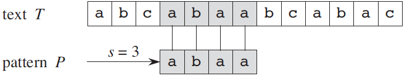
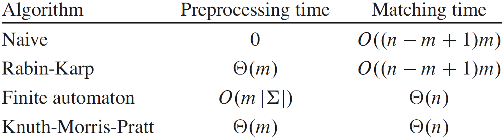
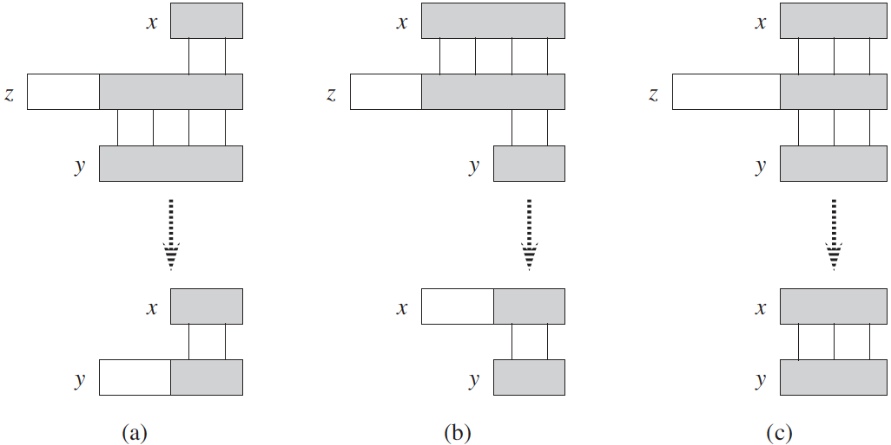

.. _ch32:

***************
String Matching
***************

    An example of the string-matching problem, where we want to find all
    occurrences of the pattern :math:`P=\mathtt{abaa}` in the text
    :math:`T=\mathtt{abcabaabcabac}`. The pattern occurs only once in the text,
    at shift :math:`s=3`, which we call a valid shift. A vertical line connects
    each character of the pattern to its matching character in the text, and
    all matched characters are shaded.

Text-editing programs frequently need to find all occurrences of a pattern in
the text. Typically, the text is a document being edited, and the pattern
searched for is a particular word supplied by the user. Efficient algorithms
for this problem—called “string matching”—can greatly aid the responsiveness of
the text-editing program. Among their many other applications, string-matching
algorithms search for particular patterns in DNA sequences. Internet search
engines also use them to find Web pages relevant to queries.

We formalize the string-matching problem as follows. We assume that the text is
an array :math:`T[1 \twodots n]` of length :math:`n` and that the pattern is an
array :math:`P[1 \twodots m]` of length :math:`m \le n`. We further assume that
the elements of :math:`P` and :math:`T` are characters drawn from a finite
alphabet :math:`\Sigma`. For example, we may have :math:`\Sigma = \{ \mathtt{0,
1} \}` or :math:`\Sigma = \{ \mathtt{a,b,\ldots,z} \}`. The character arrays
:math:`P` and :math:`T` are often called :strongemph:`strings` of characters.

Referring to :numref:`fig32-1`, we say that pattern :math:`P`
:strongemph:`occurs with shift` :math:`s` in text :math:`T` (or, equivalently,
that pattern :math:`P` :strongemph:`occurs beginning at position` :math:`s+1`
in text :math:`T`) if :math:`0 \le s \le n-m` and :math:`T[s+1 \twodots s+m] =
P[1 \twodots m]` (that is, if :math:`T[s+j]=P[j]`, for :math:`1 \le j \le m`).
If :math:`P` occurs with shift :math:`s` in :math:`T`, then we call :math:`s` a
:strongemph:`valid shift`; otherwise, we call :math:`s` an :strongemph:`invalid
shift`. The :strongemph:`string-matching problem` is the problem of finding all
valid shifts with which a given pattern :math:`P` occurs in a given text
:math:`T`.

    The string-matching algorithms in this chapter and their preprocessing and
    matching times.

Except for the naive brute-force algorithm, which we review in :ref:`Section
32.1<sec32-1>`, each string-matching algorithm in this chapter performs some
preprocessing based on the pattern and then finds all valid shifts; we call
this latter phase “matching.” :numref:`fig32-2` shows the preprocessing and
matching times for each of the algorithms in this chapter. The total running
time of each algorithm is the sum of the preprocessing and matching times.
:ref:`Section 32.2<sec32-2>` presents an interesting string-matching algorithm,
due to Rabin and Karp. Although the :math:`\Theta((n-m+1)m)` worst-case
running time of this algorithm is no better than that of the naive method, it
works much better on average and in practice. It also generalizes nicely to
other pattern matching problems. :ref:`Section 32.3<sec32-3>` then describes a
string-matching algorithm that begins by constructing a finite automaton
specifically designed to search for occurrences of the given pattern :math:`P`
in a text. This algorithm takes :math:`O(m|\Sigma|)` preprocessing time, but
only :math:`\Theta(n)` matching time. :ref:`Section 32.4<sec32-4>` presents the
similar, but much cleverer, Knuth-Morris-Pratt (or KMP) algorithm; it has the
same :math:`\Theta(n)` matching time, and it reduces the preprocessing time to
only :math:`\Theta(m)`.

.. rubric:: Notation and terminology

We denote by :math:`\Sigma^*` (read “sigma-star”) the set of all finite-length
strings formed using characters from the alphabet :math:`\Sigma`. In this
chapter, we consider only finite-length strings. The zero-length
:strongemph:`empty string`, denoted :math:`\varepsilon`, also belongs to
:math:`\Sigma^*`. The length of a string :math:`x` is denoted :math:`|x|`. The
:strongemph:`concatenation` of two strings :math:`x` and :math:`y`, denoted
:math:`xy`, has length :math:`|x|+|y|` and consists of the characters from
:math:`x` followed by the characters from :math:`y`.

    A graphical proof of :numref:`lem32-1`. We suppose that :math:`x \sqsupset
    z`and :math:`y \sqsubset z`. The three parts of the figure illustrate the
    three cases of the lemma. Vertical lines connect matching regions (shown
    shaded) of the strings. **(a)** If :math:`|x| \le |y|`, then :math:`x
    \sqsupset y`. **(b)** If :math:`|x| \ge |y|`, then :math:`y \sqsupset x`.
    **(c)** If :math:`|x|=|y|`, then :math:`x=y`.

We say that a string :math:`w` is a :strongemph:`prefix` of a string :math:`x`,
denoted :math:`w \sqsubset x`, if :math:`x=wy` for some string :math:`y \in
\Sigma^*`. Note that if :math:`w \sqsubset x`, then :math:`|w| \le |x|`.
Similarly, we say that a string :math:`w` is a :strongemph:`suffix` of a string
:math:`x`, denoted :math:`w \sqsupset x`, if :math:`x=yw` for some :math:`y \in
\Sigma^*`. As with a prefix, :math:`w \sqsupset x` implies :math:`|w|\le|x|`.
For example, we have :math:`\mathtt{ab \sqsubset abcca}` and :math:`\mathtt{cca
\sqsupset abcca}`. The empty string :math:`\varepsilon` is both a suffix
and a prefix of every string. For any strings :math:`x` and :math:`y` and any
character :math:`a`, we have :math:`x \sqsupset y` if and only if :math:`xa
\sqsupset ya`. Also note that :math:`\sqsubset` and :math:`\sqsupset` are
transitive relations. The following lemma will be useful later.

.. raw:: latex

    \par
    \begin{lem}[Overlapping-suffix lemma]
    Text-editing programs frequently need to find all occurrences of a pattern in
    the text. Typically, the text is a document being edited, and the pattern
    searched for is a particular word supplied by the user. Efficient algorithms
    \end{lem}

Suppose that :math:`x`, :math:`y`, and :math:`z` are strings such that
:math:`x \sqsupset z` and :math:`y \sqsupset z`. If :math:`|x| \le |y|`,
then :math:`x \sqsupset y`. If :math:`|x| \ge |y|`, then :math:`y \sqsupset x`.
If :math:`|x|=|y|`, then :math:`x=y`.

.. toctree::

    sec1
    sec2
    sec3
    sec4
